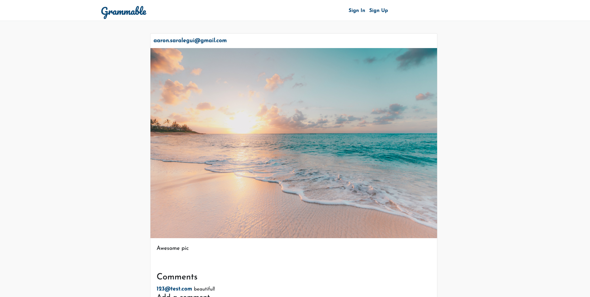

# easilysmart 

An Instagram clone that was built using industry-standard, test-driven development following numerous red/green/refactor cycles.
Here is a live feed of the website. [here](https://grammable-saralegui.herokuapp.com) If you would like to create a account and try, go right ahead.

Test Driven Development is the industry standard. learned how to build automated software test in ruby, ensure good test coverage, and release prefectly tested code on the level of professional developer

# Features: 

* Contains HTML, CSS, RUBY, Rails, and Algorithms

* Devise is used for user authentication and sign-in forms, could be used for email as well.

* Carrierwave is used for aws.

* Bootstrap is also used in this application

* Postgresql is the database that is being used in this application.

# Acknowledgments

University of Arizona coding bootcamp

